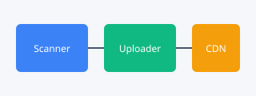

# 深度学习入门讲义（样例文档）

本文档用于演示 md-image-uploader 的工作流程。文中包含本地图片引用，
运行 `upload_images.py` 后这些引用会被替换为图床 URL。

## 架构总览

系统分为三层：扫描器、上传器、CDN 加速。



## 幂等性设计

通过本地 manifest 文件记录已上传图片的哈希值，避免重复上传。


## 代码示例（应被跳过）

下面代码块里的图片引用**不应该**被上传：

```markdown

```

同样，行内代码 `` 也不应被处理。

## 已经是远程的图片（应被跳过）


这种以 `https://` 开头的引用会原样保留，不参与上传。

---

运行后，上面的 `assets/architecture.svg` 和 `assets/flowchart.svg`
会变成形如 `https://cdn.example.com/2026/07/ab12cd34.svg` 的链接。
